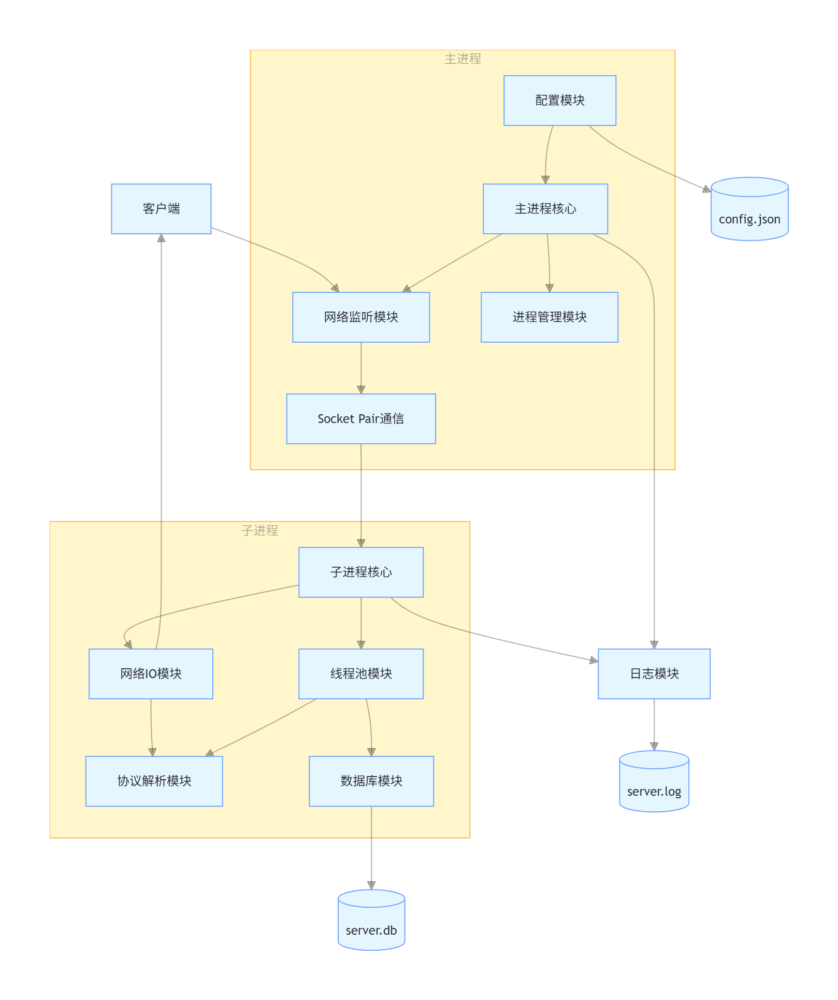
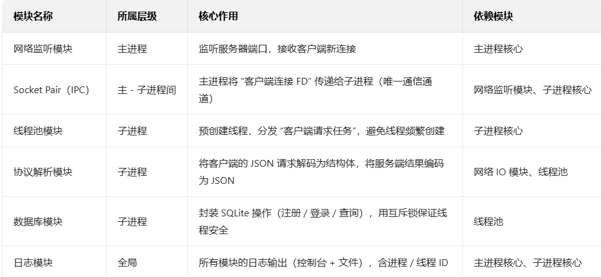
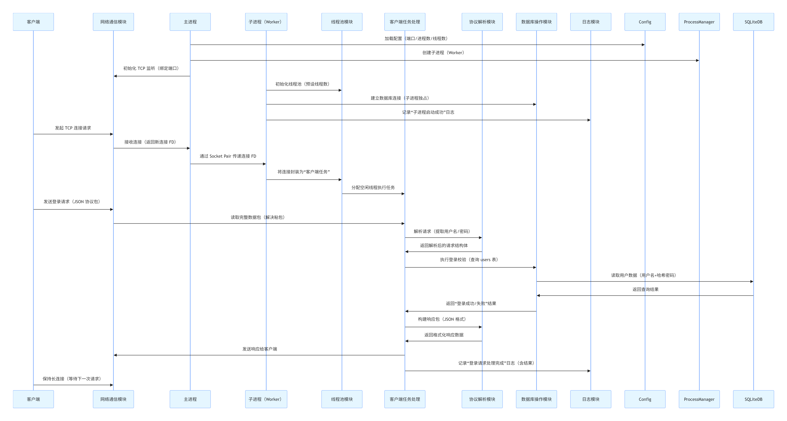

# 1. 项目说明
开发一款基于 Linux 平台的 C++ 演示服务器，整合多进程、多线程、TCP/IP 网络编程及数据库操作等核心技术，作为个人学习与面试准备的实践载体。通过面向对象设计，展示 C++ 特性在系统编程中的应用，覆盖现代 C++（C++17 及以上）的核心语法与库功能。

## 技术栈
- 编程语言：C++11（主要），少量 Linux 系统调用
- 开发环境：Ubuntu 22.04
- 编译工具：GCC 9+ 或 Clang 10+，CMake 3.16+
- 网络库：基于系统 socket API 的 C++ 封装（或轻量库如 **asio**）
- 数据库：SQLite3（通过 C++ 封装库 SQLiteCpp 操作）
- 并发控制：C++ 标准库 std::thread、std::mutex 等
- 构建系统：CMake

## 静态架构图与模块功能说明
客户端静态架构图为


模块功能说明：



已客户端的申请为例，各模块的调用流程图为：



## 客户端 UML 类图


# 2 功能需求
## 2.1 核心功能模块
- **TCP 服务器功能**
    1. 支持绑定指定 IP 和端口（默认端口 8080）
    1. 监听客户端连接请求，支持最大 100 个并发连接
    1. 实现基于 “包头 + 包体” 的自定义协议，解决 TCP 粘包问题
    1. 包头：4 字节无符号整数（网络字节序），表示包体长度
    1. 包体：JSON 格式字符串，包含命令与参数

- **支持 3 类核心命令**：
    1. 注册：{"cmd":"register", "username":"xxx", "password":"xxx", "email":"xxx"}
    2. 登录：{"cmd":"login", "username":"xxx", "password":"xxx"}
    1. 数据查询：{"cmd":"query", "key":"xxx"}
    1. 响应格式：{"status":0, "msg":"success", "data":{...}}（0 表示成功，非 0 表示错误码）

## 2.2 进程管理模块
- **主进程职责**
    1. 初始化服务器环境（信号处理、日志目录创建）
    1.  创建监听套接字，绑定并监听端口
    1. 采用 “预创建子进程” 模式，启动固定数量的工作子进程（默认 4 个）
    1. 通过 socket pair 实现主进程与子进程的通信（传递新连接描述符）
    1. 监控子进程状态，实现崩溃自动重启

- **子进程职责**
    1. 从主进程接收客户端连接
    1. 管理线程池，分发任务至工作线程
    1. 维护数据库连接（每个子进程一个连接，通过互斥锁保证线程安全）


## 2.3 线程池模块
- **线程池管理**
    1. 每个子进程初始化固定大小的线程池（默认 8 个线程）
    1. 基于 std::queue 实现任务队列，支持任务动态添加
    1. 采用 std::mutex + std::condition_variable 实现线程同步
    1. 支持线程池优雅关闭（处理完所有任务后退出）

- **任务处理流程**
    1. 接收客户端连接后，封装为 ClientTask 对象加入任务队列
    1. 工作线程从队列获取任务，解析请求协议
    1. 调用对应业务逻辑（注册 / 登录 / 查询），操作数据库
    1. 生成响应数据，发送给客户端
    1. 处理完成后保持连接（长连接），等待下一次请求

## 2.4 数据库操作模块
数据存储设计
数据库文件：server.db（SQLite3 格式）
核心表结构：
```sql
数据存储设计
数据库文件：server.db（SQLite3 格式）
核心表结构：
sql
CREATE TABLE IF NOT EXISTS users (
  id INTEGER PRIMARY KEY AUTOINCREMENT,
  username TEXT UNIQUE NOT NULL,
  password TEXT NOT NULL,
  email TEXT,
  create_time TIMESTAMP DEFAULT CURRENT_TIMESTAMP
);
CREATE TABLE IF NOT EXISTS data (
  id INTEGER PRIMARY KEY AUTOINCREMENT,
  user_id INTEGER NOT NULL,
  key TEXT NOT NULL,
  value TEXT,
  update_time TIMESTAMP DEFAULT CURRENT_TIMESTAMP,
  FOREIGN KEY(user_id) REFERENCES users(id)
);

```
- C++ 接口封装
1. 提供 DatabaseManager 类，封装 SQLiteCpp 操作
- 核心方法：
    1. `bool connect(const std::string& db_path)`：连接数据库
    1. `bool registerUser(const std::string& username, const std::string& password, const std::string& email)`：注册用户
    1. `int loginUser(const std::string& username, const std::string& password)`：登录验证（返回用户 ID）
    1. `bool setData(int user_id, const std::string& key, const std::string& value)`：存储键值对
    1. `std::optional<std::string> getData(int user_id, const std::string& key)`：查询键值对
    1. 支持事务操作，确保数据一致性

C++ 接口封装
提供 DatabaseManager 类，封装 SQLiteCpp 操作
核心方法：
bool connect(const std::string& db_path)：连接数据库
bool registerUser(const std::string& username, const std::string& password, const std::string& email)：注册用户
int loginUser(const std::string& username, const std::string& password)：登录验证（返回用户 ID）
bool setData(int user_id, const std::string& key, const std::string& value)：存储键值对
std::optional<std::string> getData(int user_id, const std::string& key)：查询键值对
支持事务操作，确保数据一致性


## 2.5 日志模块
- 实现简易日志系统，支持 3 级日志（INFO/WARN/ERROR）
- 日志格式：[时间] [级别] [进程ID:线程ID] 消息内容
- 输出方式：同时输出到控制台和文件（logs/server.log）
- 基于 C++ 流操作（std::ostream）实现，支持格式化输出


# 非功能需求


## 4. 技术细节与 C++ 特性应用
技术点	C++ 实现方式

1. **多进程通信**： 用 std::array<int, 2> 封装 socket pair，结合 std::unique_ptr 管理文件描述符
1. **多线程同步**： std::mutex（互斥锁）、std::condition_variable（条件变量）、std::lock_guard（RAII 锁管理）
1. **内存管理**： 智能指针（std::unique_ptr/std::shared_ptr）管理动态资源，避免内存泄漏
1. **网络编程**： 封装 TcpServer/TcpConnection 类，用 std::string 处理缓冲区，std::byte 表示二进制数据
1. **异常处理**： 自定义异常类（NetworkException/DbException），结合 try-catch 处理错误
1. **类型安全**： 用 enum class 替代 enum，constexpr 定义常量，static_assert 编译期校验
1. **数据库交互**： 通过 SQLiteCpp 库实现类型安全的 SQL 操作，避免裸指针和 C 风格函数
1. **配置解析**： 用 nlohmann/json 库（头文件 - only）解析 JSON 配置，返回 std::optional 处理缺失键


# 验收标准
## 功能验收
1. 服务器能正常启动，监听指定端口
2. 客户端可通过 TCP 连接发送注册 / 登录 / 查询命令并收到正确响应
3. 主进程能监控子进程，崩溃后自动重启
4. 线程池能并发处理多个客户端请求，无数据竞争
5. 数据库操作结果正确持久化（重启服务器后数据不丢失）
## 代码验收
1. 不使用 C 风格的线程库（pthread），完全基于 C++ 标准库 std::thread
2. 无内存泄漏（通过 valgrind 检测）
3. 核心模块覆盖率 > 80% 的单元测试（用 Google Test 框架）
## 性能验收
1. 50 个客户端并发连接时，服务器稳定运行无崩溃
1. 连续 1000 次数据库操作无异常


# 5. 思考
豆包生成的软件需求说明书过于杂乱，实际上真正要实现的是一个单 Reactor 多线程的框架，暂不需要多进程的内容。